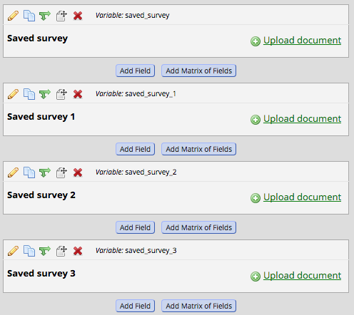
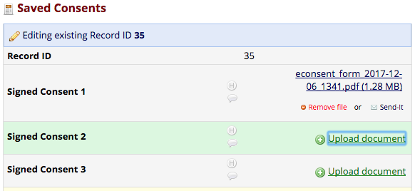
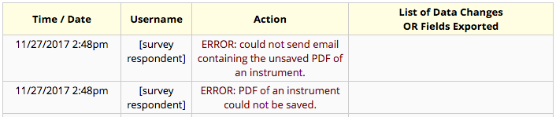

# Save Survey PDF to a Field

This REDCap module generates a PDF of a survey upon completion and saves it to a REDCap file upload field. It is configured at the project level with source instrument/target field pairs. In the event of save errors, the PDF is sent to a backup email address.

NOTE: This module has been modified for use in Vanderbilt’s system. Features may differ from the authors’ original information on this page. Please read the final section on this page for more details.

## Prerequisites
- REDCap >= 8.0.0 (for versions < 8.0.0, [REDCap Modules](https://github.com/vanderbilt/redcap-external-modules) is required).

## System-level Installation
- Clone this repo into to `<redcap-root>/modules/save_survey_pdf_to_field_v<module_version_number>`.
- Go to **Control Center > Manage External Modules** and enable _Save Survey PDF to a Field_.
- Still in **Control Center > Manage External Modules**, configure the module with a 'From Address' for any emails this module sends out. Optionally set an email address that will be CC'd in any such emails. Emails will only be sent if the module fails to save a PDF of a survey.

## Project-level Installation

Before you can configure this module, you will need to create the surveys and fields needed for configuration. This module can save PDFs for as many surveys as desired, but each survey is saved as its own PDF. The PDFs must be saved to file upload fields in a non-survey instrument. On that instrument create a file upload field for each survey that needs to be saved.

Should you need to save multiple revisions of a survey PDF for a single record\_id, use the Online Designer to copy the file upload field as many times as you need. This module will use the basename of the original field name and append '\_1', '\_2', '\_3', etc. looking for additional fields into which it can save the PDF. If your original field name has the format `field_name_1`, the module will increment the number at the end of field name by `1` and look for `field_name_2`, `field_name_3`, etc. until it finds an empty file upload field.

With the surveys and file upload fields created, you can proceed with module configuration.

- For each project on which you want to use this module, go to the project home page, click on **Manage External Modules** link, and then enable _Save Survey PDF to a Field_ for that project.
- Configure the module with the an email address that should receive generated PDFs for this project should this module be unable to save the PDF.
- Also configure the module with the names of surveys for which you want to save PDFs and the field names in which those surveys should be stored. Survey names and file names are entered in pairs to allow as many different surveys to be saved as needed.

## Using the module

A series of file upload fields to receive saved PDFs, if configured, would look like this in the Online Designer.

Once the first PDF has been saved, those same fields would look like this in the Data Entry form

## In case of errors

If the module cannot save the PDF it will attempt to send an email with the PDF attached to the email address configured on the project.  It will use the _From Address_ configured at the system level for the module. It will also log an error to the projects REDCap log.  Should the _email_ fail, that will also be logged.  Those log events look like this:

####Notes about Vanderbilt’s version of this module: 

This module has been modified for use in Vanderbilt’s system. The original authors’ information is still available on this page and should still be accurate in most cases. But some features may differ. The module is now developed by Vanderbilt’s Data Core (datacore@vumc.org). Here are some notes about Vanderbilt’s version:
1.	The File Upload field can be located on any type of instrument, not just a survey. Field logging is not accessible via the History icon on the instrument.
2.	The module works best with classic project designs – meaning the longitudinal module and repeatable instruments/events features should be disabled in most situations. (If enabling the longitudinal module is necessary, the survey being saved to the module and the File Upload field for the PDF should both be located on the same longitudinal event. And if using this module with repeatable instruments/events is necessary, be aware that instance data may be overwritten/lost, e.g. if the survey is saved multiple times.) 
3.	If editing of the survey data is allowed, the File Upload field will automatically save and overwrite the PDF with the new version (even if the File Upload field is itself located on another survey which does not allow editing). Previous versions of the PDF are not stored anywhere so are lost. 
4.	The 'Run PDF Save from Data Entry Form too' feature does not activate when the instrument’s form status is Incomplete. Save using another status (e.g. Unverified, Complete) to activate this feature.
5.	If the File Upload field’s variable name used in this module is changed after configuration of this module, the module will NOT update the variable name automatically. The PDF will simply fail to upload, with no warning, orphaning the data and making it inaccessible. Update the module configuration on the project’s External Modules page manually to ensure the current variable name is always selected.
6.	In case of errors, the feature to send an email with the PDF attached does not actually attach the PDF in most cases. It simply sends the email, with no copy of the PDF.
7.	The module works well with REDCap’s emailing features (e.g. Alerts & Notifications, Automated Survey Invitations). The timing for sending the email should be set to at least one minute after the survey completion, to ensure the PDF is fully saved before the emailing features try to attach it to the email message.
